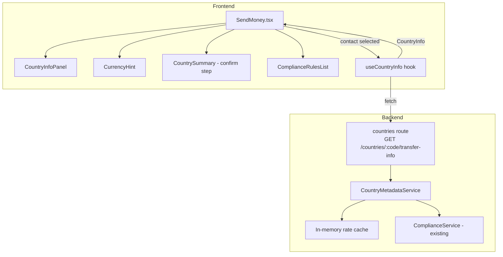

# Design Document: Country Transfer UX

## Overview

This feature enriches SwiftSend's send flow with three categories of country-specific context: compliance rules, delivery time estimates, and live currency hints. The work spans a new backend endpoint (`GET /countries/:code/transfer-info`) and a set of new React components that slot into the existing `SendMoney` page.

The existing `SendMoney.tsx` already has a five-step flow (recipient → amount → confirm → processing → success) and already holds static per-country data in `CASH_PICKUP_PARTNER_BY_COUNTRY` and `DESTINATION_CURRENCY_BY_COUNTRY`. This design replaces those static maps with live data from the new API and surfaces that data to the user at the right moment in the flow.

Key design decisions:
- **Single API call per recipient selection**: The frontend fetches country metadata once when a contact is selected and caches it for the duration of the send flow. This avoids repeated round-trips as the user moves between steps.
- **Graceful degradation everywhere**: Every piece of country-specific UI has a defined fallback so that an API failure never blocks a transfer.
- **No new global state**: Country metadata is held in local component state within `SendMoney.tsx` and passed down as props, keeping the change surface small.

---

## Architecture



The frontend uses a custom React hook (`useCountryInfo`) that wraps a `@tanstack/react-query` query. The backend adds a new Fastify route file (`countries.ts`) and a new `CountryMetadataService` that owns the country data, rate cache, and compliance rule mapping.

---

## Components and Interfaces

### Frontend

#### `useCountryInfo(countryCode: string | null)`

A React Query hook that fetches and caches country metadata.

```typescript
interface UseCountryInfoResult {
  data: CountryInfo | null;
  isLoading: boolean;
  isError: boolean;
}

function useCountryInfo(countryCode: string | null): UseCountryInfoResult
```

- Returns `{ data: null, isLoading: false, isError: false }` when `countryCode` is `null` (new recipient by email/phone).
- Caches results with a 5-minute stale time via React Query.
- On error, sets `isError: true` and returns `data: null`.

#### `CountryInfoPanel`

Displayed on the recipient step (after contact selection) and the amount step.

```typescript
interface CountryInfoPanelProps {
  countryInfo: CountryInfo | null;
  isLoading: boolean;
  isError: boolean;
}
```

Renders:
- Country name, flag emoji, ISO code
- Available cash-out methods with delivery estimates
- Compliance rules as plain-language statements
- Restricted corridor warning (with `role="alert"`) that blocks advancing to the amount step
- Skeleton loader while `isLoading` is true
- Fallback message when `isError` is true

#### `CurrencyHint`

Displayed inline in the amount input area.

```typescript
interface CurrencyHintProps {
  currencyCode: string | null;
  exchangeRate: number | null;
  amount: number;          // raw USDC amount entered
  totalFee: number;        // computed fee for the entered amount
  locale?: string;         // destination country locale, e.g. "es-MX"
}
```

- Shows `"{currencyCode}"` when `exchangeRate` is null or `amount <= 0`.
- Shows converted amount and rate label when `amount > 0` and `exchangeRate` is available.
- Wraps the converted amount in `aria-live="polite"`.
- Formats numbers using `Intl.NumberFormat` with the destination locale.

#### `CountrySummary`

Displayed on the confirm step.

```typescript
interface CountrySummaryProps {
  countryInfo: CountryInfo;
  selectedMethod: CashOutMethod;
  amount: number;
  totalFee: number;
}
```

Renders the country name/flag, selected method, delivery estimate, and currency hint with converted amount.

#### `ComplianceRulesList`

Displayed on the confirm step when `complianceRules.length > 0`.

```typescript
interface ComplianceRulesListProps {
  rules: string[];
  onAllAcknowledged: (acknowledged: boolean) => void;
}
```

Renders each rule as a checkbox. Calls `onAllAcknowledged(true)` when every checkbox is checked, `onAllAcknowledged(false)` otherwise. The confirm button in `SendMoney.tsx` is disabled until `onAllAcknowledged(true)` fires.

### Backend

#### `CountryMetadataService`

```typescript
interface CashOutMethod {
  type: 'cash_pickup' | 'bank_transfer' | 'mobile_money' | 'home_delivery';
  partnerName: string;
  deliveryMinMinutes: number;
  deliveryMaxMinutes: number;
}

interface CountryInfo {
  countryCode: string;
  countryName: string;
  currencyCode: string;
  exchangeRate: number | null;
  rateStaleAt?: string;          // ISO timestamp; present when rate is stale
  isRestricted: boolean;
  complianceRules: string[];
  cashOutMethods: CashOutMethod[];
}

class CountryMetadataService {
  getCountryInfo(code: string): Promise<CountryInfo>
  refreshRateIfStale(code: string): Promise<void>
}
```

- Throws `NotFoundError` for unknown country codes.
- Returns `isRestricted: true` with `cashOutMethods: []` for restricted corridors.
- Holds an in-memory rate cache keyed by country code with a `cachedAt` timestamp.
- Refreshes the rate when `Date.now() - cachedAt > 60 * 60 * 1000`.

#### `countries` route

```
GET /countries/:code/transfer-info
```

- No authentication required (public metadata).
- Validates `:code` against `^[A-Z]{2}$`; returns HTTP 400 on mismatch.
- Returns HTTP 404 for unknown codes.
- Returns HTTP 200 with `CountryInfo` JSON for all other cases (including restricted countries).

---

## Data Models

### `CountryInfo` (shared frontend/backend)

```typescript
interface CountryInfo {
  countryCode: string;           // "MX"
  countryName: string;           // "Mexico"
  currencyCode: string;          // "MXN"
  exchangeRate: number | null;   // 17.25 (USDC → MXN); null if unavailable
  rateStaleAt?: string;          // ISO 8601 timestamp when rate was last refreshed
  isRestricted: boolean;
  complianceRules: string[];     // ["Government ID required for cash pickup"]
  cashOutMethods: CashOutMethod[];
}

interface CashOutMethod {
  type: 'cash_pickup' | 'bank_transfer' | 'mobile_money' | 'home_delivery';
  partnerName: string;
  deliveryMinMinutes: number;
  deliveryMaxMinutes: number;
}
```

### Backend static country registry

The `CountryMetadataService` holds a static map of supported countries seeded from the existing `mockData.ts` contacts and `withdrawalMethods`. Initial supported countries: MX, PH, GT, SV. Restricted countries are sourced from `ComplianceService.highRiskDestinations` (RU, BY, IR, KP).

### Rate cache entry

```typescript
interface RateCacheEntry {
  rate: number;
  cachedAt: number;   // Date.now() timestamp
}
```

### Delivery estimate formatting

The `CountryInfoPanel` and `CountrySummary` components format delivery estimates from the raw `deliveryMinMinutes` / `deliveryMaxMinutes` fields using a pure helper function:

```typescript
function formatDeliveryEstimate(minMinutes: number, maxMinutes: number): string
// minMinutes === maxMinutes → "~15 min"
// minMinutes !== maxMinutes → "15 min – 2 hrs"
```

### Currency conversion formula

```
convertedAmount = (amount - totalFee) × exchangeRate
```

This matches the formula in Requirement 3.2 and is implemented as a pure function:

```typescript
function convertAmount(
  amount: number,
  totalFee: number,
  exchangeRate: number
): number
```

---

## Correctness Properties

*A property is a characteristic or behavior that should hold true across all valid executions of a system — essentially, a formal statement about what the system should do. Properties serve as the bridge between human-readable specifications and machine-verifiable correctness guarantees.*

### Property 1: CountryInfoPanel renders complete country data

*For any* `CountryInfo` object with a non-empty `cashOutMethods` array and a non-empty `complianceRules` array, the rendered `CountryInfoPanel` SHALL display the country name, flag emoji, ISO code, every cash-out method (with its delivery estimate), and every compliance rule as a plain-language statement.

**Validates: Requirements 1.1, 1.2, 1.3, 2.1**

### Property 2: Delivery estimate formatting — equal min/max

*For any* non-negative integer `n`, `formatDeliveryEstimate(n, n)` SHALL return a string that starts with "~" and contains the value `n`, and SHALL NOT contain a range separator ("–").

**Validates: Requirements 2.4**

### Property 3: Delivery estimate consistency through the flow

*For any* `CashOutMethod`, the delivery estimate string displayed on the confirm step SHALL be identical to the delivery estimate string displayed on the success step for the same method.

**Validates: Requirements 2.6**

### Property 4: Currency conversion formula correctness

*For any* positive `amount`, non-negative `totalFee` where `totalFee < amount`, and positive `exchangeRate`, `convertAmount(amount, totalFee, exchangeRate)` SHALL equal `(amount - totalFee) × exchangeRate` within floating-point tolerance (1e-9).

**Validates: Requirements 3.2**

### Property 5: CurrencyHint suppresses converted amount when amount ≤ 0 or rate is null

*For any* `amount <= 0` or `exchangeRate === null`, the `CurrencyHint` SHALL display only the destination currency code and SHALL NOT render a converted amount value.

**Validates: Requirements 3.3, 3.7**

### Property 6: Rate label format

*For any* positive `exchangeRate` and valid `currencyCode`, when `CurrencyHint` is rendered with `amount > 0`, the secondary label SHALL match the format `"1 USDC = {rate} {currencyCode}"`.

**Validates: Requirements 3.6**

### Property 7: API response schema completeness for supported countries

*For any* supported country code, the `GET /countries/:code/transfer-info` endpoint SHALL return HTTP 200 with a JSON body containing all required fields: `countryCode`, `countryName`, `currencyCode`, `exchangeRate`, `isRestricted`, `complianceRules` (array), and `cashOutMethods` (array of objects each with `type`, `partnerName`, `deliveryMinMinutes`, `deliveryMaxMinutes`).

**Validates: Requirements 4.2**

### Property 8: Restricted country API response shape

*For any* country code in the restricted set (`RU`, `BY`, `IR`, `KP`), the `GET /countries/:code/transfer-info` endpoint SHALL return HTTP 200 with `isRestricted: true` and `cashOutMethods: []`.

**Validates: Requirements 4.4**

### Property 9: Country code validation rejects non-alpha-2

*For any* string that does not match `^[A-Z]{2}$`, the `GET /countries/:code/transfer-info` endpoint SHALL return HTTP 400.

**Validates: Requirements 4.7**

### Property 10: Confirm step renders all required summary elements

*For any* `CountryInfo` with a non-empty `complianceRules` array and any selected `CashOutMethod`, the confirm step SHALL render: the destination country name and flag, the selected method name, the delivery estimate for that method, the currency hint with converted amount, and each compliance rule as a checkbox.

**Validates: Requirements 5.1, 5.2**

### Property 11: Compliance rules gate disables send button

*For any* non-empty `complianceRules` array where at least one rule is unacknowledged, the confirm/send button SHALL be disabled.

**Validates: Requirements 5.4**

### Property 12: Locale-aware currency formatting

*For any* positive `amount` and destination locale (e.g., `"es-MX"`, `"fil-PH"`), the formatted converted amount SHALL use the decimal and grouping separator conventions of that locale as produced by `Intl.NumberFormat`.

**Validates: Requirements 6.5**

### Property 13: Stale rate cache still returns a rate

*For any* supported country whose cached rate is older than 60 minutes and whose upstream source is unavailable, the `GET /countries/:code/transfer-info` endpoint SHALL return HTTP 200 with a non-null `exchangeRate` (the cached value) and a `rateStaleAt` ISO timestamp.

**Validates: Requirements 3.5, 4.6**

---

## Error Handling

| Scenario | Frontend behaviour | Backend behaviour |
|---|---|---|
| `GET /countries/:code/transfer-info` returns 4xx/5xx | `CountryInfoPanel` shows "Country information is temporarily unavailable." User may still proceed. | N/A |
| `GET /countries/:code/transfer-info` returns 404 | Same fallback as above | Returns `{ error: "Country not supported" }` with HTTP 404 |
| `GET /countries/:code/transfer-info` returns 400 | Not reachable from UI (country codes come from contacts) | Returns `{ error: "Invalid country code" }` with HTTP 400 |
| Exchange rate unavailable | `CurrencyHint` shows currency code only, no converted amount | Returns `exchangeRate: null` in response body |
| Exchange rate stale, upstream down | `CurrencyHint` shows converted amount with a "(rate may be outdated)" note | Returns cached rate + `rateStaleAt` |
| Restricted corridor | `CountryInfoPanel` shows `role="alert"` warning; "Continue" button is hidden | Returns `isRestricted: true`, `cashOutMethods: []` |
| Network offline (existing `useNetworkStatus`) | Existing offline banner already blocks transfer submission; country info fetch is skipped | N/A |

All API errors are caught in the `useCountryInfo` hook's `onError` callback and surfaced via `isError: true`. The hook never throws to the component tree.

---

## Testing Strategy

### Unit tests (Jest + React Testing Library)

- `formatDeliveryEstimate`: example-based tests for equal min/max, different min/max, and edge values (0 minutes, very large values).
- `convertAmount`: example-based tests for typical values, zero fee, and fee equal to amount minus epsilon.
- `CountryInfoPanel`: render tests for loading state, error state, restricted corridor warning (`role="alert"` present), and normal state with rules and methods.
- `CurrencyHint`: render tests for null exchange rate, zero amount, positive amount with rate, and locale formatting.
- `ComplianceRulesList`: interaction test — all boxes checked → `onAllAcknowledged(true)`; one unchecked → `onAllAcknowledged(false)`.
- `CountryMetadataService`: unit tests for known country, unknown country (throws), restricted country, stale rate refresh logic.
- Countries route: integration tests using Fastify's `inject` for valid code, invalid code (400), unknown code (404), restricted code (200 + `isRestricted`).

### Property-based tests (fast-check)

The project uses Jest as its test runner. [fast-check](https://fast-check.io/) is the property-based testing library to add (it integrates directly with Jest via `fc.assert`). Each property test runs a minimum of 100 iterations.

**Property 1 — CountryInfoPanel renders complete country data**
```typescript
// Feature: country-transfer-ux, Property 1: CountryInfoPanel renders complete country data
fc.assert(fc.property(
  fc.record({
    countryCode: fc.stringMatching(/^[A-Z]{2}$/),
    countryName: fc.string({ minLength: 1 }),
    currencyCode: fc.string({ minLength: 3, maxLength: 3 }),
    exchangeRate: fc.float({ min: 0.001, max: 1000, noNaN: true }),
    isRestricted: fc.constant(false),
    complianceRules: fc.array(fc.string({ minLength: 1 }), { minLength: 1, maxLength: 5 }),
    cashOutMethods: fc.array(
      fc.record({
        type: fc.constantFrom('cash_pickup', 'bank_transfer', 'mobile_money', 'home_delivery'),
        partnerName: fc.string({ minLength: 1 }),
        deliveryMinMinutes: fc.integer({ min: 0, max: 1440 }),
        deliveryMaxMinutes: fc.integer({ min: 0, max: 1440 }),
      }),
      { minLength: 1, maxLength: 4 }
    ),
  }),
  (countryInfo) => {
    const { getByText } = render(<CountryInfoPanel countryInfo={countryInfo} isLoading={false} isError={false} />);
    // Assert country name, code, each method, each rule are present
    expect(getByText(countryInfo.countryName)).toBeInTheDocument();
    countryInfo.cashOutMethods.forEach(m => expect(getByText(m.partnerName)).toBeInTheDocument());
    countryInfo.complianceRules.forEach(r => expect(getByText(r)).toBeInTheDocument());
    return true;
  }
), { numRuns: 100 });
```

**Property 2 — Delivery estimate formatting (equal min/max)**
```typescript
// Feature: country-transfer-ux, Property 2: delivery estimate formatting equal min/max
fc.assert(fc.property(
  fc.integer({ min: 0, max: 10000 }),
  (n) => {
    const result = formatDeliveryEstimate(n, n);
    return result.startsWith('~') && !result.includes('–');
  }
), { numRuns: 100 });
```

**Property 3 — Delivery estimate consistency through the flow**
```typescript
// Feature: country-transfer-ux, Property 3: delivery estimate consistency through the flow
fc.assert(fc.property(
  fc.record({
    type: fc.constantFrom('cash_pickup', 'bank_transfer', 'mobile_money', 'home_delivery'),
    partnerName: fc.string({ minLength: 1 }),
    deliveryMinMinutes: fc.integer({ min: 0, max: 1440 }),
    deliveryMaxMinutes: fc.integer({ min: 0, max: 1440 }),
  }),
  (method) => {
    const estimateAtConfirm = formatDeliveryEstimate(method.deliveryMinMinutes, method.deliveryMaxMinutes);
    const estimateAtSuccess = formatDeliveryEstimate(method.deliveryMinMinutes, method.deliveryMaxMinutes);
    return estimateAtConfirm === estimateAtSuccess;
  }
), { numRuns: 100 });
```

**Property 4 — Currency conversion formula correctness**
```typescript
// Feature: country-transfer-ux, Property 4: currency conversion formula correctness
fc.assert(fc.property(
  fc.float({ min: 0.01, max: 10000, noNaN: true }),
  fc.float({ min: 0, max: 9999, noNaN: true }),
  fc.float({ min: 0.001, max: 1000, noNaN: true }),
  (amount, fee, rate) => {
    fc.pre(fee < amount);
    const result = convertAmount(amount, fee, rate);
    return Math.abs(result - (amount - fee) * rate) < 1e-9;
  }
), { numRuns: 100 });
```

**Property 5 — CurrencyHint suppresses converted amount when amount ≤ 0 or rate is null**
```typescript
// Feature: country-transfer-ux, Property 5: CurrencyHint suppresses converted amount when amount <= 0 or rate is null
fc.assert(fc.property(
  fc.oneof(
    fc.record({ amount: fc.constant(0), exchangeRate: fc.float({ min: 0.001, max: 1000, noNaN: true }) }),
    fc.record({ amount: fc.float({ max: -0.001, noNaN: true }), exchangeRate: fc.float({ min: 0.001, max: 1000, noNaN: true }) }),
    fc.record({ amount: fc.float({ min: 0.01, max: 10000, noNaN: true }), exchangeRate: fc.constant(null) }),
  ),
  ({ amount, exchangeRate }) => {
    const { queryByTestId } = render(
      <CurrencyHint amount={amount} currencyCode="MXN" exchangeRate={exchangeRate} totalFee={0} />
    );
    return queryByTestId('converted-amount') === null;
  }
), { numRuns: 100 });
```

**Property 6 — Rate label format**
```typescript
// Feature: country-transfer-ux, Property 6: rate label format
fc.assert(fc.property(
  fc.float({ min: 0.001, max: 10000, noNaN: true }),
  fc.stringMatching(/^[A-Z]{3}$/),
  (rate, currencyCode) => {
    const { getByTestId } = render(
      <CurrencyHint amount={100} currencyCode={currencyCode} exchangeRate={rate} totalFee={0} />
    );
    const label = getByTestId('rate-label').textContent ?? '';
    return label.includes('1 USDC =') && label.includes(currencyCode);
  }
), { numRuns: 100 });
```

**Property 7 — API response schema completeness for supported countries**
```typescript
// Feature: country-transfer-ux, Property 7: API response schema completeness for supported countries
fc.assert(fc.property(
  fc.constantFrom('MX', 'PH', 'GT', 'SV'),
  async (code) => {
    const response = await app.inject({ method: 'GET', url: `/countries/${code}/transfer-info` });
    const body = JSON.parse(response.body);
    return response.statusCode === 200
      && typeof body.countryCode === 'string'
      && typeof body.countryName === 'string'
      && typeof body.currencyCode === 'string'
      && 'exchangeRate' in body
      && typeof body.isRestricted === 'boolean'
      && Array.isArray(body.complianceRules)
      && Array.isArray(body.cashOutMethods);
  }
), { numRuns: 100 });
```

**Property 8 — Restricted country API response shape**
```typescript
// Feature: country-transfer-ux, Property 8: restricted country API response shape
fc.assert(fc.property(
  fc.constantFrom('RU', 'BY', 'IR', 'KP'),
  async (code) => {
    const response = await app.inject({ method: 'GET', url: `/countries/${code}/transfer-info` });
    const body = JSON.parse(response.body);
    return response.statusCode === 200
      && body.isRestricted === true
      && Array.isArray(body.cashOutMethods)
      && body.cashOutMethods.length === 0;
  }
), { numRuns: 100 });
```

**Property 9 — Country code validation rejects non-alpha-2**
```typescript
// Feature: country-transfer-ux, Property 9: country code validation rejects non-alpha-2
fc.assert(fc.property(
  fc.string().filter(s => !/^[A-Z]{2}$/.test(s)),
  async (code) => {
    const response = await app.inject({
      method: 'GET',
      url: `/countries/${encodeURIComponent(code)}/transfer-info`
    });
    return response.statusCode === 400;
  }
), { numRuns: 100 });
```

**Property 10 — Confirm step renders all required summary elements**
```typescript
// Feature: country-transfer-ux, Property 10: confirm step renders all required summary elements
fc.assert(fc.property(
  fc.record({
    countryName: fc.string({ minLength: 1 }),
    complianceRules: fc.array(fc.string({ minLength: 1 }), { minLength: 1, maxLength: 5 }),
    cashOutMethods: fc.array(
      fc.record({
        type: fc.constantFrom('cash_pickup', 'bank_transfer'),
        partnerName: fc.string({ minLength: 1 }),
        deliveryMinMinutes: fc.integer({ min: 1, max: 60 }),
        deliveryMaxMinutes: fc.integer({ min: 60, max: 240 }),
      }),
      { minLength: 1, maxLength: 3 }
    ),
  }),
  (countryInfo) => {
    const method = countryInfo.cashOutMethods[0];
    const { getByText, getAllByRole } = render(
      <CountrySummary countryInfo={{ ...countryInfo, currencyCode: 'MXN', exchangeRate: 17.25, isRestricted: false, countryCode: 'MX' }}
                      selectedMethod={method} amount={100} totalFee={0.5} />
    );
    expect(getByText(countryInfo.countryName)).toBeInTheDocument();
    expect(getByText(method.partnerName)).toBeInTheDocument();
    // delivery estimate and currency hint are present
    return true;
  }
), { numRuns: 100 });
```

**Property 11 — Compliance rules gate disables send button**
```typescript
// Feature: country-transfer-ux, Property 11: compliance rules gate disables send button
fc.assert(fc.property(
  fc.array(fc.string({ minLength: 1 }), { minLength: 1, maxLength: 10 }),
  fc.integer({ min: 0 }),
  (rules, uncheckedIdx) => {
    fc.pre(uncheckedIdx < rules.length);
    const { getByRole, getAllByRole } = render(
      <ComplianceRulesList rules={rules} onAllAcknowledged={jest.fn()} />
    );
    const checkboxes = getAllByRole('checkbox');
    // Check all except uncheckedIdx
    checkboxes.forEach((cb, i) => { if (i !== uncheckedIdx) fireEvent.click(cb); });
    const sendButton = getByRole('button', { name: /send/i });
    return sendButton.hasAttribute('disabled');
  }
), { numRuns: 100 });
```

**Property 12 — Locale-aware currency formatting**
```typescript
// Feature: country-transfer-ux, Property 12: locale-aware currency formatting
fc.assert(fc.property(
  fc.float({ min: 0.01, max: 100000, noNaN: true }),
  fc.constantFrom('es-MX', 'fil-PH', 'es-GT', 'es-SV', 'en-US'),
  (amount, locale) => {
    const formatted = formatConvertedAmount(amount, locale);
    const expected = new Intl.NumberFormat(locale).format(amount);
    return formatted.includes(expected.replace(/[^\d.,]/g, '').slice(0, 4));
  }
), { numRuns: 100 });
```

**Property 13 — Stale rate cache still returns a rate**
```typescript
// Feature: country-transfer-ux, Property 13: stale rate cache still returns a rate
fc.assert(fc.property(
  fc.constantFrom('MX', 'PH', 'GT', 'SV'),
  async (code) => {
    // Seed cache with a rate timestamped 61 minutes ago; mock upstream as unavailable
    seedStaleCache(code, 17.25, Date.now() - 61 * 60 * 1000);
    mockUpstreamUnavailable();
    const response = await app.inject({ method: 'GET', url: `/countries/${code}/transfer-info` });
    const body = JSON.parse(response.body);
    return response.statusCode === 200
      && body.exchangeRate !== null
      && typeof body.rateStaleAt === 'string';
  }
), { numRuns: 100 });
```
